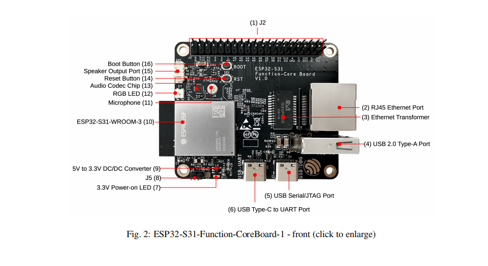

# rtt_nano_s31 —— 把 RT-Thread Nano 搬到 ESP32-S31（**完全不用 ESP-IDF 构建系统**）

> 一块 **ESP32-S31-Function-CoreBoard-1**（双核 RISC-V @320MHz / 16MB flash / **16MB PSRAM**），
> 一个**不用 ESP-IDF 构建系统**的 RT-Thread 移植：
> 自写启动汇编 + 链接脚本，直接用 `riscv32-esp-elf-gcc` 编译，用独立 `esptool` 生成/烧录，
> 镜像由芯片 **bootROM 直接从 flash 0x2000 加载**（连 IDF 的二级 bootloader 都不要）。
> 控制台走芯片内置 **USB-Serial/JTAG**（就是你一直用的 COM43），tick 用 **SYSTIMER**，中断走 **CLIC**。
> 外设走 **RT-Thread 设备框架**：`PIN` / `SPI`（含 `QSPI`）/ `I2C` 三类标准 ops，msh 里可直接验证。



> 板子正面（图：乐鑫官方《ESP32-S31 DevKits User Guide》Fig.2，仅作接线说明用）。
> 本工程用到图上这几处：
> **(5) USB Serial/JTAG** = 控制台 `COM43`（也是烧录口）；
> **(1) J2 排针** = 外设全在它上面（SPI 屏 SCK43/MOSI44/CS45/DC46/RST47/BL48、I2C0 = 50/51、I2C1 = 2/3、外接 SPI 模块 = 43/44/45/46）；
> **(10) ESP32-S31-WROOM-3** 模组自带 **16MB PSRAM**（下面 **§5.10** 的测速用的就是它）；
> **(12) RGB LED** 本工程暂未驱动（想加可以照 `boot_msc_s31` 的 RMT 驱动抄）。
> 其余接口（网口/音频/咪头）本工程没用到。

---

## 1. 快速上手

**日常用 make**（薄封装，逻辑还是在 `tools\*.ps1`）：

```powershell
cd esp32s31_rtt_nano      # 仓库根（作者本机的开发目录是 E:\esp-idf-s31\projects\rtt_nano_s31）

make fetch                            # ① 拉 RT-Thread 源码（按 rt-thread.pin 钉住的版本，稀疏检出）
make help                             # 目标一览
make build                            # 编译 -> build\app.bin（增量）
make flash                            # 编译 + 烧到 flash 0x2000 + 读 4 秒日志
make run                              # flash 之后一直看串口（Ctrl+C 退出；SECONDS=8 只看 8 秒）
make msh MSH="help|psram_info|free"   # 敲 msh 命令并收响应
make monitor SECONDS=8                # 只看串口
make size                             # 段大小 + CLIC 入口对齐检查
make rebuild / clean                  # 全量重编 / 删 build\
make safe                             # **救砖档**：CPU 回 40MHz（完全不动时钟树）
make watch / tail / reset             # 不复位观察 / 容错观察（看复位循环）/ 手动拉 EN 复位
make headers / doc                    # 维护类：重冻结 IDF 头 / 渲染文档 PDF
```

### 依赖：需要什么、不需要什么（2026-09-25 在干净目录里实测过）

| 需要 | 干什么用 | 怎么来 |
|---|---|---|
| **RISC-V 工具链** `riscv32-esp-elf-gcc` | 编译 | 装了 IDF 就有（`~\.espressif\tools\riscv32-esp-elf\`）|
| **RT-Thread 源码** | 编译 | `make fetch` 一条命令（稀疏检出，版本钉在 `rt-thread.pin`）|
| **python + esptool** | 烧录 | `pip install esptool`；或直接用 IDF 的 python 环境 |
| **PowerShell** | make 背后干活的脚本 | Windows 自带 5.1，或 pwsh 7 |
| ~~**ESP-IDF**~~ | —— | **编译/烧录都不需要**。IDF 那边只有 45 个头文件被用到，已经**冻结**在 `bsp/idf_headers/` 里；只有 `make headers`（重新冻结）才需要 IDF 源码树 |

> ✅ **验证方式**：把仓库跟踪的文件（89 个）单独导出到一个空目录，`make fetch` + `make build`
> 能编出**逐字节相同**的 `app.bin`（63792 B）—— 也就是"换台机器只要有工具链就能编"。
> ⚠️ 这个测试当时抓出一个真 bug：`fetch_rtt.ps1` 的稀疏检出清单漏了 `components/drivers`，
> 新 clone 编到 `rtdevice.h` 就断（本机因为早期手工补过目录，一直没暴露）。

不用 make 也行，等价命令：

```powershell
pwsh -File tools\fetch_rtt.ps1        # ① 拉 RT-Thread 源码（稀疏检出，只拿内核+klibc+finsh，不进 git）
pwsh -File tools\build.ps1            # ② 编译 + 烧录 + 抓开机日志
pwsh -File tools\build.ps1 -Msh "help|s31_info|spi_loop|i2c_scan"   # ③ 烧完直接敲 msh 命令

# 常用开关
pwsh -File tools\build.ps1 -BuildOnly            # 只编译
pwsh -File tools\build.ps1 -Rebuild              # 全量重编
pwsh -File tools\build.ps1 -Safe                 # **救砖档**：CPU 回 40MHz（完全不动时钟树）
pwsh -File tools\msh.py COM43 "ps" 3             # 不进烧录，单独敲命令看输出
pwsh -File tools\read_port.py COM43 5            # 只看串口
pwsh -File tools\reset_probe.py COM43 5          # 板子不理人时手动拉 EN 复位（--boot0 进下载模式）
```

端口取 `local.env.ps1` 里的 `ESP32_S31_PORT`（没有就用环境变量，再没有就 `COM43`）；
临时换：`make monitor PORT=COM7`。

工具链与烧录器都用**绝对路径**，不加载 IDF 环境、不调用 `idf.py`：
`%USERPROFILE%\.espressif\tools\riscv32-esp-elf\esp-15.2.0_20251204\...\riscv32-esp-elf-gcc.exe`
与 IDF python 环境里的 `python -m esptool`（esptool 5.4.0，原生支持 `esp32s31`）。

> ⚠️ 工作区的 `make run PROJ=...` 走的是 IDF 那套，**对本工程不适用**（这正是本工程的目的），
> 所以本工程自带 `Makefile`（和 `boot_msc_s31`/`s31_app` 一个套路）。
> ⚠️ 镜像烧在 **0x2000**，会覆盖 IDF 的二级 bootloader —— 恢复办法见 §8。
> ⚠️ 顺带提醒：`boot_msc_s31`（MSC 拖拽 bootloader）也烧在 `0x2000`，两边来回切要重烧。

### msh 命令一览（本工程自己的）

| 命令 | 作用 |
|---|---|
| `s31_info` | 板子信息：实测主频（rdcycle×systimer）、RAM 窗口、堆、tick |
| `s31_clk_cmd` | 时钟树状态 + 提频守卫（哨兵地址 / 跳过次数） |
| `s31_cli_cmd` | CLIC + SYSTIMER 现场（调 tick 不来/只来一次时用） |
| `s31_spin` | 忙循环计数（换频率前后对比用） |
| `s31_key` | 读 BOOT 键（GPIO61） |
| `s31_loop [n]` | GPIO 回环自检（需外部跳线） |
| `pin read/write/mode` | RT-Thread 标准 pin 命令（`P61`、`P47`…） |
| `spi_loop [hz]` | **SPI 自环回自检**（无需外部器件，逐字节校验 + 量位率） |
| `spi_id [hz]` | 读 SPI flash JEDEC ID（0x9F），浮空/内部下拉两遍判别 |
| `spi_pins [matrix\|iomux]` | 切换/回读 SPI 接线（焊盘 MCU_SEL / OUT_SEL / 输入路由） |
| `qspi_id [lines]` | QSPI 读（0x4B），按**时钟数**核对命令/地址/空转/数据四阶段 |
| `i2c_scan [bus] [v]` | I2C 扫地址（`i2c0`/`i2c1`） |
| `i2c_dbg` / `i2c_wave` / `i2c_rep` | I2C 排错三件套：寄存器 dump / 采 SCL-SDA 电平 / 重复探测抓标志竞争 |
| `s31_reg r\|w <addr> [n\|val]` | 通用寄存器读写（查焊盘路由、复现"上次挂了"都靠它） |
| `psram_info` | **PSRAM 状态/容量/快速自检**（原始事务写 + cache 映射读）|
| `psram_test [KB]` | **PSRAM 写 pattern 再逐字节读回**（默认 256 KB，报错字数与首错位置）|
| `psram_speed [KB]` | **PSRAM 读写带宽**（内部 RAM 做对照；见 §5.10 的数字与三个测速坑）|
| `reboot` | 整片复位（走 RTC 看门狗；见 §5.9 的说明 —— **别用 core0 软复位**） |
| `lcd [demo\|fill <色>\|clk <hz>]` | 外接 SPI 屏（AXS15352 240×296）：`lcd demo` = 8 色 × 2 轮刷屏，`lcd fill r\|g\|b\|black\|white\|rg\|gb\|rb` 单色，`lcd clk 10000000` 降时钟（花屏时用） |
| `sf probe <spi_dev>` | **官方 SFUD 命令**：识别外接 flash（如 `sf probe flash0`；⚠️ 每次复位后要重敲） |
| `sf read/erase/write/status` | 官方 `sf` 的读写擦（`sf read <addr> <size>`、`sf erase <addr> <size>`、`sf write <addr> <b0> <b1>…`） |
| `list device` | 看设备框架里的设备 —— 外接 flash 是块设备 **`spi_flash0`**（2048×4KB，留给 DFS 用） |

---

## 2. 当前状态（真板实测，2026-09-23）

| 项目 | 状态 |
|---|---|
| 启动 | ✅ bootROM 直启（日志 `load:0x2f000000,... / entry 0x2f000000`，无 IDF bootloader） |
| 内核 | ✅ RT-Thread Nano **v5.2.2**（src 14 个 .c + klibc + libcpu/risc-v/common） |
| **CPU 主频** | ✅ **319~320 MHz**（`rdcycle × systimer` 实测；CPLL 320MHz + root 时钟原子切换） |
| msh | ✅ `help` / `ps` / `free` / `date` / `list ...` + 上面那张表的自定义命令 |
| tick | ✅ SYSTIMER @16MHz（**与 CPU 频率无关**的时基），1ms/tick |
| 中断 | ✅ CLIC（`S31_CLIC_EXT_OFFSET=16`；RT-Thread 分发表只认 ID 16~31） |
| 控制台 | ✅ USB-Serial/JTAG：`usj` **设备 + 2KB 发送环形缓冲 + RX 环形缓冲（CLIC 17 中断）** |
| **PSRAM** | ✅ **16MB 8 线 DDR @200MHz**，窗口 `0x50000000`；读写 **106~122 MB/s**（内部 RAM 511 做对照）—— 见 §5.10 |
| 设备框架 | ✅ `RT_USING_DEVICE` + `PIN` + `SPI` + `QSPI` + `I2C`（**不用** DM/device-ipc，全走经典 ops） |
| GPIO/PIN | ✅ `drv_gpio.c`：`rt_pin_ops`，`pin read/write/mode`，含 GPIO32~63 第二组寄存器 |
| I2C | ✅ `drv_i2c.c`：`i2c0`(SCL=50/SDA=51，板载 ES8311) / `i2c1`(SCL=2/SDA=3)，`i2c_scan i2c0` 稳定扫到 **0x18** |
| SPI | ✅ `drv_spi.c`：`spi2` 总线 + `flash0` 设备，自环回自检 **1/5/10/20MHz 全部 64/64 字节一致** |
| QSPI | ✅ `qspi2` 总线 + `qflash0` 设备（`rt_qspi_transfer_message`）；一帧时钟数与理论吻合 |
| 外接屏 | ✅ `drv_lcd_axs15352.c`：240×296 SPI 屏，`lcd demo` 8 色 × 2 轮（70.1 ms/帧），**屏上目视确认** |
| reboot | ✅ TIMG0 MWDT 整片复位（`rst:0x7` HP 看门狗0），起来后 320MHz 正常 |
| 复位 | ✅ 四个看门狗全部处理（RTC_WDT / TIMG0-1 MWDT / **超级看门狗 SWD**）；开机自报复位原因 |
| 堆 | ✅ ~425 KB（链接脚本切出来的 RAM 区） |
| 镜像大小 | 约 50 KB（`.bin`，含 finsh + 三个外设驱动） |

> ⚠️ **板上那颗 16MB flash 挂在 SPI0/1（专用脚），不在 GPSPI2 上**；`flash0` 指的是 J2 上
> 外接的 SPI NOR 模块（默认接线 SCK=43 / MOSI=44 / MISO=45 / CS=46）。

---

## 3. 启动链与内存布局（都不是猜的，有出处）

```
上电/复位
 └─ bootROM（芯片固件）
     ├─ 从 flash 0x2000 读二级镜像（esptool: BOOTLOADER_FLASH_OFFSET=8192）
     ├─ 把镜像每个 LOAD 段搬到它自己的 VMA（都在 0x2F000000 起的 RAM 里）
     └─ 跳到镜像头里的 entry（= _start）
         └─ 我们的 startup.S → entry()（RT-Thread）→ rtthread_startup()
```

| 事实 | 值 | 出处 |
|---|---|---|
| 二级镜像偏移 | `0x2000` | esptool `esp32s31.BOOTLOADER_FLASH_OFFSET` |
| RAM 窗口 | `0x2F000000 .. 0x2F07AFC0` | `soc.h:152` + `ld.hp_mem_defs:9` |
| ROM 自己的栈 | `0x2F07CFB0` + 8KB | `soc.h:209`（在我们窗口之上，不冲突） |
| 中断控制器 | **CLIC** | `soc_caps.h` `SOC_INT_CLIC_SUPPORTED=1` |
| 外设中断号 | 源 33 = SYSTIMER_TARGET0，源 2 = USB_SERIAL_JTAG | `soc/interrupts.h` |
| 路由矩阵 | `0x20585000 + 4*source` ← CLIC ID | `hal/interrupt_clic_ll.h:41` |
| 外设基址 | USJ `0x20391000`、I2C0/1 `0x20385000`/`0x20386000`、GPSPI2/3 `0x2038F000`/`0x20390000`、GPIO `0x20583000`、IO_MUX `0x20582000`、CLKRST `0x20587000` | `soc.h` / `reg_base.h` |

段布局（`build/app.map`）：`.boot` → `.clic_entry`（64B 对齐跳板）→ `.text` → `.rodata`
→ `.rti_fn`（自动初始化表）→ `.fsymtab`（msh 命令表）→ `.data` → `.sdata` → `.bss` → `.sbss`
→ 堆 → 中断栈 4KB → 启动栈 8KB（`__stack_top = 0x2F07AFC0`）。
**三张表必须排在 `__heap_start` 之前**，否则会被堆写花（§6.2）。

---

## 3b. 移植教程（PDF）

**`doc/RT-Thread 移植实录：从空目录到 msh 跑起来.pdf`**（17 页）——
写给"会 C/C、但没有 RT-Thread 经验"的人：前置知识（RT-Thread 启动模型、自动初始化表、裸机工程缺什么、
RISC-V 必备 CSR）→ 九步移植（每步：产出文件 + 关键代码 + 怎么验证）→ 三个必踩的坑 →
步骤/文件/验证总表。**讲到 msh 跑起来为止**，设备驱动只做一句话衔接。

## 3c. 启动文件・链接脚本・ELF 三方对照（PDF，29 页）

**`doc/startup.S × linker.ld × app.elf 三方对照.pdf`** —— 回答"**为什么必须这么排**"：

- 从 `app.bin` 的头 32 字节 / 4 个段 / 尾部摘要讲起（ROM 怎么把镜像搬进 RAM，为什么**不需要** `AT>`）；
  含 **esptool `elf2image` 与 `objcopy -O binary` 的逐项区别**（尺寸账、字节级对照、
  1 字节 XOR 校验和 + 32 字节 SHA-256 的算法都实测核对过）
- `startup.S` **逐条**对照反汇编（47 条指令 / 188 字节里每一行的地址、符号、为什么）
- `linker.ld` **逐段**对照（11 个段的真实地址与大小、空隙总账、谁贡献、3 条 ASSERT、
  所有 `PROVIDE` 魔法符号一张表）
- ⭐ `.rti_fn` 初始化表：**每 4 个字节**解码成函数名 + 消费它的循环的真实反汇编
  （`0x2f00d370..0x2f00d38c`）+ 本 port 的一个实测发现（0/1 级那半张表没人遍历）
- `.fsymtab`：24 条 msh 命令的账怎么对上（288 B = 24 × 12 B）
- `gp`/小数据：**实测实验**（调整段序后 gp 相对寻址 7 → 143 条、`.text` −408 B），以及为什么本工程**不改**
- 三次真实事故复盘（堆写花表 → 跳 0x8C、`--gc-sections` 删表、哨兵被清零）
- 附录：地址↔符号↔源码行速查、复现命令、术语表

源码是 `doc/rt-thread-porting-tutorial.md` 与 `doc/startup-linker-elf-annotated.md`，改完重新生成 PDF：

```powershell
pwsh -File tools\build_doc.ps1          # pandoc → HTML → Edge headless → PDF（doc 下所有 md）
pwsh -File tools\build_doc.ps1 -Name startup-linker-elf-annotated   # 只渲染一篇
```

---

## 4. 目录结构

```
rtt_nano_s31/
├── bsp/
│   ├── startup.S          上电入口：关看门狗 / 设栈 / 设 gp / mtvec=CLIC入口 / 清 bss / 进 entry()
│   ├── trap_gcc.S         CLIC 64B 对齐跳板 + rt_hw_do_after_save_above
│   ├── trap_handler.c     中断分发 + 异常现场打印（覆盖 libcpu 的弱符号）
│   ├── board.c            堆初始化 + 时钟初始化 + 开机横幅 + **复位原因自报**
│   ├── drv_clk.c          **320MHz**：CPLL 起振/标定 → 分频器 → root 时钟原子切换 + 实测频率 + 提频守卫
│   ├── drv_systick.c      SYSTIMER 1ms tick + CLIC + `s31_systimer_get_ticks()`（全工程的时基）
│   ├── drv_usj.c          USB-Serial/JTAG 底层（发送/接收环形缓冲 + pump）
│   ├── drv_usj_dev.c      `usj` 字符设备（RX 中断 → rx_indicate → 设备框架）
│   ├── drv_gpio.c         PIN 设备：rt_pin_ops（GPIO32~63 走第二组寄存器）
│   ├── drv_i2c.c          I2C 主机：rt_i2c_bus_device_ops（i2c0/i2c1）
│   ├── drv_spi.c          GPSPI2 主机：rt_spi_ops + QSPI ops（spi2/qspi2、flash0/qflash0）
│   ├── s31_iomux_table.h  63 个焊盘 → IO_MUX 偏移（tools\gen_iomux_table.ps1 生成）
│   ├── rtconfig.h         Nano 风格配置 + 设备框架开关
│   ├── linker.ld          内存布局 + 三张"必须 KEEP"的表 + `.noinit` 跨复位保留区
│   ├── s31_regs.h         用到的寄存器地址（每个都标了 IDF 出处）
│   └── syscalls_stub.c    newlib 系统调用桩
├── app/main.c           main 线程 + 全部 msh 命令
├── rt-thread/           上游源码（tools\fetch_rtt.ps1 拉取，**不进 git**）
├── prebuilt/            IDF bootloader.bin + partition-table.bin（留着恢复用，见 §8）
├── doc/                移植教程 + 启动/链接/S ELF 对照（各一份 .md 与生成的 PDF）
├── tools/
│   ├── fetch_rtt.ps1      稀疏检出 RT-Thread（v5.2.2，记 commit）
│   ├── build.ps1          逐文件编译 → 链接 → elf2image → 烧 0x2000 → 抓日志（`-Safe` 救砖档）
│   ├── gen_iomux_table.ps1 从 IDF 的 io_mux_reg.h 生成焊盘偏移表
│   ├── build_doc.ps1      doc\*.md → PDF（pandoc + Edge headless）
│   ├── msh.py             开串口 → 等启动 → 敲命令 → 收响应（存证据）
│   ├── read_port.py       单纯读串口
│   ├── usj_watch.py       **开端口不碰 DTR/RTS** 的观察器（区分"谁在复位板子"）
│   ├── tail_port.py       容错观察：设备掉了自动重开，用来抓复位循环
│   └── reset_probe.py     手动 DTR/RTS 复位探测（板子不理人时用）
└── captures/            实测抓包（不进 git）
```

---

## 5. BSP 实现要点

### 5.1 控制台：USB-Serial/JTAG（`drv_usj.c` + `drv_usj_dev.c`）
- 寄存器只有两个：`EP1`(+0x0) 读写字节、`EP1_CONF`(+0x4) 的 `wr_done(data_free/out_avail)`。
- **发送走 2KB 环形缓冲**：`rt_kprintf` → 缓冲 → 由「本次输出结束」和「每 1ms 的 tick 中断」两个时机灌进 64 字节的 TX FIFO。
  为什么必须这样：**打开串口会让芯片复位**（USB-JTAG 的 DTR/RTS 就是复位线），复位后开机打印时主机还没开始读，
  直接写 FIFO 会把横幅开头啃掉（实测丢过 3 行）。缓冲后 2KB 以内的开机输出一条不丢。
- **接收也走环形缓冲 + 中断**：`usj` 字符设备（`INIT_DEVICE_EXPORT` 注册、`rt_console_set_device("usj")`），
  RX 中断挂 CLIC ID **17**（源 2），ISR 里只搬 FIFO → 环形缓冲 → `rx_indicate()`，`finsh` 用 `rt_device_read` 取。
- **中断上下文里绝不阻塞**：`in_isr()` 用 `mstatus.MIE` 判断（进 trap 时硬件会清零）。

### 5.2 tick：SYSTIMER + CLIC（`drv_systick.c`）
- SYSTIMER 时钟固定 XTAL 40MHz / 2.5 = **16MHz**，**与 CPU 频率无关** → 升到 320MHz 后 tick 不变。
- 配置顺序照 IDF：开时钟 → 开 unit → **计数器清零** → 配周期/目标 → `COMP0_LOAD` → 清中断 → **最后才 arm**。
- **必须开周期模式**（`TARGET0_CONF.PERIOD_MODE=1`），否则 TARGET0 是一次性比较器，tick 停在 1。
- CLIC：`ATTR=0`、`CTL=优先级1`、`IE=1`，路由矩阵写 CLIC ID **16**；阈值 `mintthresh=0x1F`，
  ⚠️ 每路优先级复位默认 `0x1F` 而阈值也是 `0x1F` —— **优先级必须显式 ≥1**，否则永远不触发。
- `s31_systimer_get_ticks()` 里读 `VALUE_VALID` 的等待**必须有上限**：时钟门控还没开时是死等（踩过，见 §6.6）。

### 5.3 320MHz：CPLL + root 时钟（`drv_clk.c`）
顺序（每一步都在日志里打标记，卡死能一眼看出停在哪）：
```
① 读 SOC_CLK_SEL(0x20587000)[1:0]      源选择：0=XTAL/1=CPLL/2=RC_FAST/3=F240M
② 开 CPLL 电源：PMU_IMM_HP_CK_POWER_1(0x207040F4) bit27/23/19 + HP_ALIVE_SYS bit29
③ 设分频比：LP_AON_CPLL_DIV(0x2070104C) ref[3:0]=1、fb[11:4]=8  → 40MHz/1*8 = 320MHz
④ 标定：ANA_PLL_CTRL0(0x20587174) 清 bit3 → 等 bit2 → 10us → 置 bit3
⑤ 设 CPU/MEM/SYS/APB 分频（寄存器值 = 分频-1）：cpu1/mem2/sys3/apb2
⑥ 原子切换：ROOT_CLK_CTRL0(0x20587014)=1，轮询自清
⑦ 告诉 ROM：ets_update_cpu_frequency = 0x2f800044
```
- **实测频率不看寄存器**：`CPU_SRC_FREQ0(0x20587168)` 在 XTAL 档读出来是 75MHz（不可信）。
  真值是 `s31_clk_measured_mhz()`：`rdcycle` 差值 ÷ SYSTIMER 微秒差 —— 得到 **319~320MHz**。
- **横向对照**：`s31_spin` 每 100 tick 的循环计数 40MHz 时 97496 → 320MHz 时 838491（**8.6 倍**）。
- APB 从 6.67MHz 变成 53.33MHz；GPSPI/I2C 的源都是 XTAL，**不受影响**（这也解释了为什么 SPI/I2C
  在 40MHz 和 320MHz 下行为完全一致）。

### 5.4 GPIO / PIN（`drv_gpio.c`）
- 实现 `rt_pin_ops` 的 mode/write/read，注册成名字叫 `pin` 的设备（`INIT_DEVICE_EXPORT`，**不能**用 BOARD 级）。
- 🚨 **GPIO32~63 是第二组寄存器**：`GPIO_OUT1_W1TS/W1TC`、`GPIO_ENABLE1_*`、`GPIO_IN1_REG`，掩码要右移 32。
- 输出脚**保留 `FUN_IE=1`**（回读用）；开漏靠 `GPIO_PINn` 的 bit2（`PAD_DRIVER`）。
- 焊盘功能选择/上下拉在 **IO_MUX**（`0x20582000` + 每脚偏移，表由 `tools\gen_iomux_table.ps1` 生成）：
  `FUN_PD` bit7 / `FUN_PU` bit8 / `FUN_IE` bit9 / `MCU_SEL` bit12（=1 走 GPIO，=2 走外设专用功能）。

### 5.5 I2C（`drv_i2c.c`）
- `i2c0`：SCL=GPIO50 / SDA=GPIO51（**板载 ES8311 codec @0x18**）；`i2c1`：SCL=GPIO45 / SDA=GPIO46。
- 一次传输 = 往 TX FIFO 压 `地址字节 + 数据`，命令字 `op<<11 | ack_val<<10 | ack_exp<<9 | ack_en<<8 | byte_num`，
  `byte_num = 数据长度 + 1`（地址算一个字节）。
- **op_code 是反直觉的**：`RSTART=6 / WRITE=1 / STOP=2 / READ=3 / END=4`
  （`esp_hal_i2c/esp32s31/.../i2c_ll.h` 才是对的，寄存器头文件里的注释是错的）。
- 🚨 两个必须做对、否则"扫出 63 个设备"的坑：
  ① **焊盘必须开漏**（`GPIO_PINn` bit2 = 1）—— 推挽会把总线顶死；
  ② **ACK 判定**用 `INT_RAW` 的 NACK 位 + `SR.RESP_REC`，而 **`RESP_REC` 的极性和寄存器头文件写的相反**
     （1 = 从机 ACK 了）。
- 背靠背扫描还会踩 **`INT_CLR` 清不掉 `TRANS_DONE` 残留**：每次传输前先读一次 `INT_RAW` 当基线，
  用掩码判"这次新产生的标志"；等待窗口用 **SYSTIMER 计时**（不是循环计数）。
- 实测：`i2c_scan i2c0` → 只有 `0x18`（ES8311）；`i2c_scan i2c1` → 0 个设备（那个口上没接东西）；
  40MHz 与 320MHz 下**寄存器 dump 完全一致**。

### 5.6 SPI / QSPI（`drv_spi.c`）
- 硬件 = **GPSPI2（0x2038F000）**，源时钟默认 **XTAL 40MHz**（与 CPU 频率无关），
  `sclk = 40MHz / (CLKDIV_PRE+1) / (CLKCNT_N+1)`；> 3/4 源频时走 `CLK_EQU_SYSCLK` 直出。
- 引脚两套接线，msh 里 `spi_pins matrix|iomux` 可切换并**回读焊盘寄存器**：
  | 模式 | 引脚 | 适用 |
  |---|---|---|
  | `matrix`（默认） | SCK=43 / MOSI=44 / MISO=45 / CS=46（都在 J2 上） | 外接 SPI NOR 模块那套线（sfud 工程同款） |
  | `iomux` | CLK=20 / MOSI=21 / MISO=22 / CS=23 / HD=24 / WP=25（MCU_SEL=2） | **真四线 QIO 只能用这组** |
- 🚨 **四线必须用专用 IO_MUX 脚**：IDF 的 `check_iomux_pins_quad()` 要求四根数据线/时钟都是外设的
  IO_MUX 脚 —— GPIO matrix 下数据线在数据相位**没法三态**（oen_sel=0 时输出使能由 GPIO_ENABLE 管，
  从机驱不动线）。那 6 个脚在板上是 SDIO 的 SD_D0\~D3/CLK/CMD（J2 的 26\~30，板上没卡座）。
- 🚨🚨 **CS 必须是"软件驱动的普通 GPIO"，不能用外设 CS0 信号**（2026-09-25 定论，为此白跑了一整轮）。
  - **现象**：外接 flash 只有**每次外设复位后的第一条事务能通**，之后永远读回全 0；
    `spi_id` 连跑两次就是"第一次 `EF 40 17`、第二次 `00 00 00`"。
  - **根因**：外设 CS0 信号只在一次 `USR` 期间有效，**两次事务之间那个焊盘没有把线抬起来**
    （既没被驱动、模块上也没有上拉）→ flash 看不到"CS 抬起"这个命令边界
    → 它把第二条 `0x9F` 当成上一条命令的续传数据吞掉 → 读回全 0。
    外设软复位能再通一次，正是因为复位瞬间焊盘松开、线被抬起来重新同步了。
  - **怎么定位的**（三条证据，值得复用）：
    1. `sf bb`（**软件位翻转**读 0x9F，完全绕开 SPI 外设、自己拉 CS）连读 5 次**全对**
       ⇒ flash/接线/供电都好，问题是驱动的；
    2. `spi_loop` 连跑 3 次全过 ⇒ 时钟/FIFO/收发通路也好（**注意环回测不到 CS**：
       它把 MISO 内部接到自己的 MOSI，不需要片选也能过）；
    3. 好读/坏读前后的 SPI2 寄存器快照**完全一致** ⇒ 没有配置寄存器被改坏；
       而 `gpio_in1` 的 CS 位（GPIO46 → bit14）空闲时是 **0**、`GPIO_ENABLE1` 是 **0**。
  - **修法**：CS 焊盘 `OUT_SEL=256`（取 GPIO_OUT 寄存器）+ **打开输出使能**
    （`GPIO_ENABLE1_W1TS`，少了这句焊盘就是高阻 —— 这也是早期"手动 GPIO 拉 CS 没生效"的真因），
    然后 `spi_cs_assert()` 拉低 / `spi_cs_release()` 拉高。空闲永远是确定的高电平。
    开机自检会打出来：
    ```
    [spi] 自检 CS: GPIO46 OUT_SEL=256(应=256) OE=1(应=1)  SCK=53 MOSI=55  MISO_IN54=557
    ```
  - ⚠️ 顺带澄清：`SPI_CK_IDLE_EDGE=BIT(29)` / `SPI_CS_KEEP_ACTIVE=BIT(30)` 这两个常量
    **是对的**（IDF `soc/esp32s31/register/soc/spi_reg.h` 确认）。别拿
    `spi_mem_c_reg.h`（那是 **MSPI/flash 控制器**那张图，MISC 在 0x34、USR 在 bit18）去对，会对错位。
- 跨消息保持片选：现在由软件决定（`cs_take` 拉低、`cs_release` 拉高），
  不再依赖 `SPI_MISC.cs_keep_active`。
- **两条 RT-Thread 总线**（同一个 `struct rt_spi_bus` 不能注册两次）：
  `spi2`（`rt_spi_ops`）+ `qspi2`（`rt_qspi_bus_register`），设备 `flash0` / `qflash0`。
- ⚠️ **PIO 一次最多 64 字节**（16 字 FIFO）；**超过 64 字节自动走 DMA**（见下）。
- 🚀 **DMA 通路（2026-09-25 加，AXI PDMA）**：让一次事务能搬任意长度。

  | 事实 | 值 | 出处（IDF esp32s31 头，都核对过） |
  |---|---|---|
  | SPI2 挂哪条 DMA | **AXI PDMA**，触发号 **1** | `gdma_channel.h` 的 `SOC_GDMA_TRIG_PERIPH_SPI2{,_BUS}` |
  | AXI DMA 基址 | **0x20348000** | `soc/reg_base.h` |
  | 通道布局 | IN 从 +0x000、OUT 从 +0x138，**步长 0x68**；CONF0+0x10、LINK1+0x20（start：IN 是 bit2、OUT 是 bit1）、LINK2+0x24（描述符地址）、PERI_SEL+0x44（[5:0]=1）、INT_RAW+0x00（bit1=suc_eof）、INT_CLR+0x0C | `axi_dma_reg.h` / `axi_dma_struct.h` |
  | 描述符 | **16 字节、8 字节对齐**；`dw0[11:0]=size/[23:12]=length/[30]=suc_eof/[31]=owner`，size=length=字节数 | `dma_types.h` + `spi_common_internal.h`（AXI 分支选 align8）+ `spi_master.c` 的填法 |
  | 合法地址段 | 内部 0x2F000000~0x2F07FFFF、外部 0x40000000~0x53FFFFFF | `axi_dma_ll_set_default_memory_range()` |
  | 时钟/复位 | `HP_SYS_CLKRST.axi_pdma_ctrl0`(+0x78)：bit0 clk_en（默认 1）、bit1 rst_en（脉冲）；`AXI_DMA.misc_conf`(+0x2A8) bit4 | `gdma_ll.h` |

  - **顺序**：先把 DMA 通道武装好 → 再起 SPI 的 `USR`（反了前几个字节没人接）；完成判据用 **SPI 的 `TRANS_DONE`(bit12)**（IDF 主机侧只等它），DMA 的 `suc_eof` 只当二次确认。
  - **上限**：一次事务 **32767 字节**（`SPI_MS_DATA_BITLEN` 18 位）；描述符链最多 16×4092。
  - 🚨 **FIFO 复位位别混**：bit29 = `rx_afifo_rst`（收）、bit30 = CPU/PIO 发 FIFO、**bit31 = DMA 发 FIFO**。PIO 用 29+30、DMA 用 29+31。清中断要写 **`DMA_INT_CLR`(0x38)**，写 `RAW` 是清不掉的。
  - 🚨 **cache 的结论**：S31 的 cache **只覆盖 0x40000000 起的外部窗口**（PSRAM 在里面），内部 RAM（0x2F000000~0x2F080000）**不经 cache** —— `SOC_CACHE_INTERNAL_MEM_VIA_L1CACHE` 在 esp32s31 未定义，`esp_cache_msync()` 对它返回 `NOT_SUPPORTED`。所以**内部 RAM 缓冲无需任何 cache 维护**（已用 4096 字节读回校验实测）。PSRAM 缓冲则一律挡回去走分块 PIO —— 不跟"写回/失效 + 64 字节行对齐"较劲，慢但绝不会错。
  - **实测**：读 8192 B **4189 µs = 1.95 MB/s**（= 20 MHz 线速 78%）；事务尺寸对照 16 B→1.10、64 B→1.68（PIO 天花板）、256 B→1.88、4096 B→1.95 MB/s（拐点就在 64/256 之间）。参考工程用 IDF 的 DMA 读 4 KB 是 2468 kB/s（98.7%）—— **剩的 22% 是 DMA/FIFO 握手开销**：实测"每字节固定多约 115 ns，且与时钟无关"（5 MHz 时效率 93%、20 MHz 时 78%），不是配置错。
- 🚨 **RT-Thread 的 QSPI 配置有两份**：`rt_qspi_device.config.parent`（`rt_qspi_configure` 写的）
  和 `rt_spi_device.parent.config`（驱动 `configure()` 实际读到的那份），两者**不会自动同步** ——
  不同步时 QSPI 的时钟/线宽设置等于没设（现象：qspi 帧快慢跟着上一次普通 SPI 的配置走）。
  驱动里给了 `s31_qspi_sync_config()`，改完 QSPI 配置必须调一次。
- ⚠️ **`rt_qspi_bus_attach_device()` 这个 API 不存在**（5.2 只有 `rt_spi_bus_attach_device[_cspin]`），
  `struct rt_qspi_device` 的第一个成员就是 `rt_spi_device`，传 `&qdev->parent` 即可。
- ⚠️ **`rt_spi_transfer_message()` 会自己遍历 message 链**逐个调 `xfer`，
  驱动的 `xfer` 只处理当前这一条（跟了 `next` 就会重复发）。
- ⚠️ **别和 I2C 抢脚**：`i2c1` 原来用 GPIO45/46，正好是 SPI2 的 MISO/CS —— 两路驱动抢同一个焊盘，
  谁后初始化谁赢。现在 `i2c1` 改成 SCL=GPIO2 / SDA=GPIO3。

### 5.7 三个"没有从机也能自证"的自检（这轮最有用的东西）
| 自检 | 证明了什么 |
|---|---|
| `spi_loop`（内部环回） | 把 MISO 输入信号临时接到 MOSI 焊盘 → 发 64 字节原样收回 ⇒ 时钟分频/移位/D 输出/Q 输入采样/`MS_DLEN`/FIFO 收发**整条通路**都对；再用 SYSTIMER 量位率，**顺便证明分频算得对**。IO_MUX 模式下改要求一根 MOSI→MISO 跳线 |
| `spi_id`（浮空 + 内部下拉两遍） | 光看 `FF FF FF` 分不清"没接模块"和"驱动错"；**加 45k 下拉再读一遍**就能判别 |
| `qspi_id`（数时钟） | 没有真实从机时，用一帧耗时反推时钟数来核对**四个阶段的装配**：1 线 = 8+24+8+24 = 64 拍，4 线数据相位 = 8+24+8+6 = 46 拍 |
| `s31_reg r\|w <addr> [n]` | 通用寄存器读写 —— 这轮靠它才发现"CS 焊盘 OUT_SEL 不对、ENABLE 位没开" |
| `pin write/read` + `s31_loop` | GPIO 通路（注意 `pin write` 之前要先 `pin mode <n> output`，否则输出驱动器没使能） |

### 5.8 外接 SPI 屏（AXS15352 240×296，`drv_lcd_axs15352.c`）
把本工作区 `spi_lcd_axs15352` 那套 IDF 驱动搬到本 port（不依赖 IDF / esp_lcd）：

- **接线**（和 5 个 `spi_lcd_*` 工程完全一致，都在 J2 上）：
  SCL=GPIO43 / SDA=GPIO44 / **CS=GPIO45** / **DC=GPIO46** / RST=GPIO47 / BL=GPIO48 / TE=GPIO49（不用）。
  → SPI 侧多了一档接线 `spi_pins` 模式 2（`s31_spi_set_pins(2)`）：SCK=43、MOSI=44、**CS0 走 GPIO45**，
  46/47/48 让出来给 DC/RST/BL 当普通 GPIO。
- **4 线 SPI + DC 线**（DC 低=命令、高=数据）；像素 **RGB565 且要换字节序**（大端）。
- **初始化表**：30 条厂表（0xCE/A0..A5/B1..B9/BA..BC/C0/C3/C4/D1/D9/E0/E1/E6/F3/F4/0x11+(100ms)/0x29），
  在 `drv_lcd_axs15352.c` 里以 `C(cmd, data...)` 宏列出，来源见文件头注释。
- 🚨 **整屏数据必须一口气发完**：PIO 单次 ≤64 字节，所以 142 KB 要切 2220 块，
  块间靠 `SPI_MISC.cs_keep_active` **保持 CS 低**（`cs_take`/`cs_release` 只在首尾那两块用）。
  中间抬一次片选，面板就会把后面的像素当新命令流。
- 实测（24 MHz，真板 + **屏已插、目视确认**）：初始化 30 条 ≈ 100 ms（含 0x11 的 100ms 延时）；
  **全屏填色 70.1 ms/帧 ≈ 2.0 MB/s**（142 KB，2220 块 × 64 字节）；
  `lcd demo` 8 色 × 2 轮跑完自动停，**屏幕上 8 种颜色（红/绿/蓝/黑/白/黄/青/洋红）确实各刷了一遍、共两轮** ✓。

### 5.9 `reboot`：为什么最后只能靠 MWDT（三条死路 + 一条活路）
| 试过的做法 | 结果 |
|---|---|
| ❌ `LP_AONCLKRST_HPCORE0_RESET_CTRL` bit20（core0 软复位，**IDF `esp_restart()` 用的就是它**） | **core0 被永久按在复位里，PC 恒为 `0x00000000`**。该位在 AON 域、**复位不清**，JTAG 写 0 也救不回来 → 只能物理 RST。IDF 敢用它是因为它前面有二级 bootloader 走完整初始化，我们是 **bootROM 直启**、没那一步 |
| ❌ RTC 看门狗 `RTC_WDT`（stg0 = RESET_SYSTEM） | 等不到复位：本 port 从没配过 RTC 慢时钟域，看门狗计数器根本没在走 |
| ❌ 关掉"超级看门狗"的自动喂狗（SWD_AUTO_FEED_EN=0）等它复位 | 也没等到 —— 自动喂狗像是"使能后就锁存"，关掉不生效 |
| ✅ **TIMG0 的 MWDT**（`WDTCONFIG0`：`stg0=3`(RESET_SYSTEM) + `wdt_en`，`WDTCONFIG1` 给计数，`WDTCONFIG2` 预分频，`WDTWPROTECT` key `0x50D83AA1`） | **通了**：`reboot` → 复位原因 `rst:0x7 (HP_SYS_HP_WDT0_RESET)`、`reset : core0=0x07 HP 看门狗0`，起来后仍 320MHz、控制台/守卫都正常 |

🛠 两个细节：① MWDT 的时钟是 HP 域 APB（跑 320MHz 时 53.3MHz），**肯定在走** —— 这是它比 RTC 系看门狗靠谱的原因；
② `reboot` 里**特意不关中断、不 `while(1)`**：万一看门狗没生效，shell 还活着能继续敲命令，
而不是像前几版那样把控制台锁死（前两版就是这么把板子写死、要物理复位的）。

实测数字见 §9。

---

### 5.10 PSRAM（16MB 8 线 DDR @200MHz）+ 读写速度实测

移植自 `boot_msc_s31/bsp/s31_psram.c` —— 那份是在真板上把 PSRAM 调通、并且把坑全踩完的版本。
`board init → s31_psram_init()`，起来之后 `(volatile uint32_t *)0x50000000` 就是普通内存。

**为什么值得整份搬（PSRAM 是本工作区最贵的一段，两个真凶都不是看手册能看出来的）**

| 真凶 | 现象 | 为什么难查 |
|---|---|---|
| **专用 1.8V LDO 没开** | MPLL 永远不收敛、PSRAM 事务读到垃圾 | LDO 在 `PMU +0x218/+0x1e8`，上电默认关；手册不会告诉你 PSRAM 还挂了个 LDO |
| 🚨 **PMA 把窗口标成只读** | **一写就 `store access fault`** | PMA 是 RISC-V **自定义 CSR**（`CSR_PMACFG15`），**寄存器 dump 里根本看不到**；ROM 把 `[0x40000000,+512MB)` 标成只读，IDF 的二级 bootloader 会去打开它，而我们顶掉了二级 bootloader |

⇒ 初始化顺序里 `pma_grant_write()` 必须在**任何 PSRAM 写之前**（日志里的
`[psram] PMA15 ... 补上写权限: c0000015 -> c000001d` 就是它）。

**实测带宽（真板 COM43，`psram_speed 256`，每项 3 轮取最小；1 MB/s = 1 B/µs）**

| 项目 | 实测 | 说明 |
|---|---|---|
| 内部 RAM 写 / 读 u32（对照） | **511 / 511 MB/s** | 4 路展开后的手写循环，接近 CPU 侧上限 |
| PSRAM 写 u32 / u64 | **106 / 105 MB/s** | 与 `s31_membench`（103~116）一致 ⇒ 是内存上限，不是量错 |
| PSRAM 读 u32 / u64 | **117 / 122 MB/s** | 顺序读受 cache 行填充限制（64B 行 ≈378ns）|
| PSRAM memset | **107 MB/s** | 和手写循环同值 ⇒ 确实到顶了 |
| PSRAM memcpy（PSRAM→PSRAM） | **54 MB/s** | 读写抢同一条总线，只有单向的一半 |
| 内部 RAM → PSRAM memcpy | **102 MB/s** | 内部 RAM 侧不是瓶颈 |
| PSRAM 16KB 反复读 | **502 MB/s** | ★ 这行量的是 **L1 命中带宽**，跟前面不是一个量纲 |

**原始输出**（`make msh MSH="psram_speed 256"`，真板 COM43 抓的，一字未改）：

```
PSRAM 带宽 @256 KB（每项 3 轮取最小；1 MB/s = 1 B/us）
  内部RAM 写 u32(对照)       513 us     511.0 MB/s
  内部RAM 读 u32(对照)       513 us     511.0 MB/s
  PSRAM 写 u32                2469 us     106.1 MB/s
  PSRAM 读 u32                2232 us     117.4 MB/s
  PSRAM 写 u64                2486 us     105.4 MB/s
  PSRAM 读 u64                2156 us     121.5 MB/s
  PSRAM memset                2447 us     107.1 MB/s
  PSRAM->PSRAM memcpy         4839 us      54.1 MB/s
  内部RAM->PSRAM memcpy       2557 us     102.5 MB/s
  PSRAM 16KB 反复读(命中L1)   2090 us     501.7 MB/s
  提示: 顺序读受 cache 行填充限制（64B/行 ≈378ns）；
        最后那行「16KB 反复读」量的是 **L1 命中带宽**（≈510 MB/s），
        跟前面几行不是一个量纲 —— 差 4 倍是正常的，别当成 PSRAM 变快了
```

**怎么复现**：

```powershell
make flash                              # 烧一版（PSRAM 初始化在 board init 里）
make msh MSH="psram_info"               # 状态/容量/快速自检
make msh MSH="psram_test 512"           # 512KB 写 pattern 再逐字节读回
make msh MSH="psram_speed 256"          # 就是上面那张表
```

> 📌 **怎么判断这组数字是可信的**：① 它和 IDF 工程 `s31_membench` 独立测的
> （PSRAM 103~116 MB/s）对得上；② 跑 `make safe`（CPU 降到 40MHz）之后
> **所有数字整体掉 8 倍**（内部 RAM 63、PSRAM 37 MB/s）—— CPU 侧一变，
> 数字跟着变，正说明量的是真的内存访问，不是固定开销或编译器把循环优化掉了。

**三个测速坑（`app/main.c` 里都写在注释上了）**

1. **读循环会被 `-O2` 整个删掉** —— 读没有内存副作用，`(void)rd32(...)` 的结果没人用
   ⇒ 现象是 `PSRAM 读 u32  0 us  0.0 MB/s`（第一次真栽在这，写因为内存副作用反而没事）。
   修法：结果落到一个 `volatile` 全局（`g_rd_sink`）。
2. **不用 `volatile` 指针量带宽** —— 量到的是循环速度不是内存速度
   （`s31_membench`：同一块内部 RAM，memset 840 vs 手写循环 141 MB/s）。
3. **循环要 4 路展开** —— 不展开时"每字约 4 周期"自己就是天花板（≈320 MB/s），
   内部 RAM / L1 命中这些比它快的东西全都量不出来（展开后 511 / 502 才出来）。

**工程侧的改动**（想知道"搬一个文件要动哪儿"就看这张表）

| 文件 | 改了什么 |
|---|---|
| `bsp/s31_psram.c` | 搬来的主体；只改了 3 处：`kprintf→rt_kprintf`、`s31_layout.h→s31_psram.h`、自带一个读 SYSTIMER 的 `s31_delay_us`（board init 阶段还不能用 `rt_thread_mdelay`）|
| `bsp/s31_psram.h` | 新增：窗口常量 + API 声明（**不含 IDF 头**）|
| `bsp/idf_headers/` | 新增：冻结的 **45 个 IDF 头 / 2.4MB**（PSRAM 那条 include 链）—— 宁可多拷，也不手抄寄存器位号 |
| `bsp/sdkconfig.h` | 新增：极简版（IDF 头要 `#include "sdkconfig.h"`）|
| `bsp/s31_regs.h` | 补 6 个外设基址 + PSRAM 窗口常量（`S31_PMU_BASE` 等）|
| `bsp/linker.ld` | 补 `PROVIDE`：外设实例符号（SPIMEM2/3、PMU、MODEM_LPCON…）+ ROM 函数（`Cache_*`、`esp_rom_spi_cmd_*`）—— IDF 靠 `.ld` 提供这些，我们不链 IDF |
| `tools/build.ps1` | 加 `-I$Bsp\idf_headers`（放最后，工程自己的同名头优先）+ 把 `s31_psram.c` 加进源码表 |

---

### 5.11 SFUD：外接 SPI flash（**走 RT-Thread 官方组件** + 块设备）

外接 flash 走的是 **RT-Thread 官方那套**，本工程**一行移植代码都没写**：

| 谁 | 在哪 | 干什么 |
|---|---|---|
| SFUD 引擎 | `rt-thread/components/drivers/spi/sfud/{inc,src}` | 上游原样（rt-thread 源码树自带） |
| **官方移植层 + `sf` 命令 + 块设备注册** | `rt-thread/components/drivers/spi/dev_spi_flash_sfud.c` | 官方自带，**一个字没改** |
| 本工程唯一的一层胶水 | `bsp/drv_spi_flash.c`（~50 行） | 调一次 `rt_sfud_flash_probe()` |
| 开关 | `bsp/rtconfig.h` | `RT_USING_SFUD` / `RT_SFUD_USING_SFDP` / `RT_SFUD_USING_FLASH_INFO_TABLE` / `RT_SFUD_SPI_MAX_HZ` |
| 构建 | `tools/build.ps1` | 直接把上面两个官方源文件加进源码表（**不拷进 bsp/**） |

```c
/* bsp/drv_spi_flash.c 的全部实质内容 */
rt_spi_flash_device_t dev = rt_sfud_flash_probe("spi_flash0", "flash0");
INIT_COMPONENT_EXPORT(s31_spi_flash_init);   /* 组件级：保证跑在设备级 drv_spi 之后 */
```

- 接线：**SCK=GPIO43(J2-17) MOSI=44(J2-18) MISO=45(J2-15) CS=46(J2-16)** + 3V3/GND
  （即 `drv_spi.c` 默认那套；`flash0` 就是挂在 `spi2` 上的 SPI 设备）
- 实测：`[I/SFUD] Found a Winbond flash chip. Size is 8388608 bytes.`
  → **块设备 `spi_flash0`：2048 扇区 × 4096 字节 = 8192 KB**，`list device` 里能看到
  （**留着块设备就是为了以后挂 DFS**；扇区 = 擦除粒度 4KB）
- 命令是官方 `sf`：`sf probe flash0` / `sf read <addr> <size>` / `sf erase <addr> <size>` /
  `sf write <addr> <b0> <b1> ...` / `sf status`
  - ⚠️ **`sf probe flash0` 每次复位后都要敲一次**：官方把选中的设备放在 static 变量里，不跨复位保留
  - ⚠️ 官方 `sf bench` 是**整片擦**（提示要打 `sf bench yes` 才动）—— 外接 flash 里可能有你的东西，慎用
  - ⚠️ `sf probe` 用的是官方自己注册的第二个块设备 `sf_cmd`，与本工程开机注册的 `spi_flash0`
    是两个 `sfud_flash` 实例（都指向同一条 SPI 设备，单独用没问题）
- ⚠️ **`RT_USING_DEBUG` 必须开**：SFUD 的 `SFUD_INFO` 就是 rtdbg 的 `LOG_I`，
  没开的话 `LOG_*` 全是空宏 —— "识别到什么芯片 / 找不到芯片"这些信息会**一声不响地消失**（踩过）。
  开了之后 SFUD 按 `DBG_LVL=DBG_INFO` 输出，就是上面那些 `[I/SFUD]` 行。
- ⚠️ **`RT_SFUD_SPI_MAX_HZ` 官方默认 50000000**，会被分频成 **40MHz**；本板这套杜邦线只验过
  20MHz（`spi_flash_sfud` 工程实测 20MHz 下 98.7% 线速），所以先定在 20MHz。
- 🚀 **任意长度由 `drv_spi.c` 的 DMA 撑着**：官方移植层**自己不切块**（页编程一次给 4+256 字节、
  读给整段），>64 字节全交给 `drv_spi.c` 的 AXI PDMA 通路（见 §5.6）—— 所以这套能跑起来的前提是
  驱动支持任意长度。实测 `sf read 0 256` 走的就是 DMA。
- 📊 实测：`sf erase` 4KB 约 **47 ms**（W25Q64 的 tSE 典型值就是 45 ms）、
  读 **1.95 MB/s**（20 MHz 线速的 78%，PIO 天花板是 1.68）。

> 🚨 **这一节最值钱的不是 SFUD，是它逼出来的那些坑** —— 见 §5.6 的"CS 必须是软件 GPIO"
> 与 §6 第 23/25 条（片选丢命令边界、切时钟把 USB 块带掉导致控制台哑）。
> 早期版本曾自写移植层 + 自写 `sf` 命令（多了 `sf dbg`/`sf bb` 等排错命令），
> 2026-09-25 按"走官方"的要求切回官方组件；那套诊断代码留在 git 里
> （提交 `0d39e26`，`bsp/sfud/port/`），需要时可以从历史里取回。
---

## 6. 踩过的坑（现象 → 根因 → 修法）

1. **`INIT_*_EXPORT` 的函数一个都不执行**（tick 不开、msh 不起，但版本号和 main 都正常）
   → `--gc-sections` 把 `.rti_fn.*` 段当"没人引用"删了 → 链接脚本里 `KEEP(*(SORT(.rti_fn*)))`。
2. **堆把初始化表写花了** → 表放在 `.sbss` 之后，而堆起点 `__bss_end` 只算到 `.sbss` 末尾
   → 凡有符号指向的区间都必须排在 `__heap_start` 之前，并加 `ASSERT(__heap_end >= __fsymtab_end)`。
3. **board 级初始化从来不会自动跑** → `rt_components_init()` 只遍历 2~6 级；
   1 级要 BSP 自己调。而且**不能在 `rt_hw_board_init()` 里开 tick**（那时定时器链表还没初始化）
   → 所有驱动都挂 **`INIT_DEVICE_EXPORT`**（device 级）。
   ⚠️ 挂错级别过一次：`drv_gpio.c` 用 `INIT_BOARD_EXPORT` 时 `pin` 命令 load access fault（`mtval=0x18`，ops 是 NULL）。
4. **`SW_handler` 不是 64 字节对齐** → 汇编器 `.align` 放松预留了 2 字节 → 自己写 64B 对齐跳板（`trap_gcc.S`）。
5. **只有一次 tick** → TARGET0 默认一次性 → 开 `PERIOD_MODE` + 按 IDF 顺序配置。
6. **改了时钟后卡死**（日志停在 `[clk] 7 switched` 之前没动静）
   → 真凶不是 PLL：`s31_systimer_get_ticks()` 里等 `VALUE_VALID` **没有上限**，而那时 SYSTIMER 的时钟门控
   还没开（`s31_systick_hw_init()` 在时钟切换之后才跑）→ 死等。
   修法：等待加超时；把"实测频率"挪到 systick 初始化之后再算。
7. **`ps` 只出表头不出行** → klibc tiny 版 vsprintf 不支持 `%-*.*s` → 换标准版。
8. **改了 `rtconfig.h` 却不生效**（报 `rt_console_set_device` 未定义）
   → build.ps1 复用了旧 `.o` → 加头文件依赖表（`rtconfig.h`/`s31_regs.h` 一改就全量重编）。
9. **I2C 扫出 63 个设备**（全 ACK）→ ① 焊盘没开漏（推挽顶死总线）；② ACK 判据用错（`RESP_REC` 极性与头文件相反）；
   ③ 背靠背扫描时 `INT_CLR` 清不掉 `TRANS_DONE` 残留 → 用"基线掩码 + SYSTIMER 计时窗口"。
10. **SPI 分频器算错**（1MHz 请求实际跑出 4.5MHz）
    → **S31 的 `CLKDIV_PRE` 只有 4 位（1\~16）**，不是老 ESP32 的 6 位（1\~64）：写 20 被硬件截成 4。
    现象很有迷惑性：**1MHz 和 5MHz 两档耗时一模一样**。是环回自检量位率时露的马脚。
11. **环回自检一直读到 0** → `spi_mux_out()` 把焊盘配成输出时会清掉 `FUN_IE`，
    同一根焊盘自己的输入通路就断了 → 环回前把 MOSI 焊盘的 IE 打开。
12. **`mtvec` / 阈值 / 优先级**：`mtvec = 入口 | 3`；`mintthresh` 写 0x1F；每路优先级必须 ≥1。
13. **开机横幅丢字 / 发命令没反应** → 开串口即复位芯片 → ① 主机脚本不许 `reset_input_buffer()`；
    ② `tools/msh.py` 等 1.8s 再敲命令；③ USJ 接收 FIFO 会重放旧字节（同一条命令可能执行两次）。
14. **编译期**：内核源必须带 `-D__RT_KERNEL_SOURCE__`；`RT_BACKTRACE_LEVEL_MAX_NR` 无 guard 被引用；
    `-nostartfiles` 下没人设 `gp` → 链接脚本给 `__global_pointer$` + startup 里 `.option norelax; la gp`。
15. 🚨 **"板子看起来是砖"的两个真凶（都在控制台这一侧，2026-09-23 定位）**：
    ① `clk_mark()` 那个"打印完等环形缓冲排空"的循环**等不到就永远等**（guard 给了 400 万次，
       320MHz 下 7 个标记 ≈ 2 秒，而且没插终端时环永远排不空）→ 固件停在开机第一步，
       连 ROM 横幅都看不到；② `s31_usj_tx_pump()` **空环时也置 `wr_done`** → 端点一直停在
       "有待发数据"，主机取到空包后不再重新武装 → 之后所有输出都发不出去。
    修法：guard 降到 20 万且**等不到就放弃**；`wr_done` **只在真的写了字节之后**才置。
16. 🚨 **USB-JTAG 的 DTR/RTS 复位在"CDC 卡死"时不生效，但 JTAG 复位有效**：
    卡住时（串口 0 字节、esptool 报 `No serial data received` / 写超时）用
    `openocd -f board/esp32s31-builtin.cfg -c "init; reset run; shutdown"` 一条命令就能把芯片拉回来
    —— 比伸手按 RST 键快，而且能顺便 `halt; reg pc` 看它到底卡在哪个函数。
17. 🚨 **别拿"硬编码的整字值"去写寄存器**：想复位 USB 设备块，写了 `CNNT_SYS+0x34 = 0x0`，
    把同寄存器里 **bit30 `sys_usb_device_48m_clk_en`（复位默认=1）** 一起清零
    → USB 设备块整块停振，CDC 和 JTAG **同时**失联，只能物理断电。
    正确姿势永远是**读-改-写**（或至少把其它位原样带上）。
    **恢复动作**：按板上 RST 键或拔插 USB-DBG 线（芯片 EN 复位会把 CNNT 寄存器恢复成默认值）；
    软件侧无解 —— 连 esptool/OpenOCD 都进不去（实测：串口报 `PermissionError(13)`、
    esptool 报 `Could not open COM43`、OpenOCD 报 `Unsupported DTM version: -1`）。
18. 🚨 **也别"隔着 JTAG"去复位 USB 设备块**（2026-09-23 第二次踩）：
    `mww 0x20359034 0xC0000000`（bit31=1 复位、bit30=1 保时钟）之后，**JTAG 自己就断了**
    （复位 USB 块 = 复位调试接口），后面那条"清复位位"的写根本没机会执行
    → 块被按在复位里，只能物理复位。要复位它就让**芯片自己**做（跑在片上的代码里读-改-写）。
19. 🚨 **`wr_done` 必须"每次都写"，哪怕一个字节都没写**（2026-09-23 定论，代价最大的一条）：
    IDF `usb_serial_jtag_ll.h:173-180` 写明"装满 64 字节的 FIFO 会被硬件自动提交，
    而主机把这个整包当**未结束的 USB 事务**，得再补一个**零长度包**（再写一次 `wr_done`）
    才会真正交给 CDC 读端"。我们的发送环按 64 字节一块灌，某次正好是整包、之后环空了，
    就再没人补这一下 → **主机读请求永远完不成** → 串口一个字节都收不到，几秒后 USB 口直接掉线
    （现象：`ClearCommError ... 设备不识别此命令`，主机反复重开串口 = "板子反复复位"）。
    我把它"优化"成"只在写了字节后才置"，反而把控制台搞死了 —— **这是本工程最贵的一次自作聪明**。
20. 🚨 **未注册的中断不能只打一行日志就返回**：外设的中断标志没人清 → 电平触发下立刻再进来 →
    死循环刷屏（实测被 USB-Serial/JTAG 的 RX 中断刷了 1.2MB，shell 完全没法用）。
    正确做法：① **装 handler 之后再使能 CLIC IE**（顺序反了就会以 NULL handler 进中断）；
    ② 默认 ISR 打几次日志后**把这一路 CLIC IE 关掉**，让系统活下来（`trap_handler.c` 已改）。
21. 🚨 **跨复位保留不能用 LP 域的 scratch 寄存器**：`LP_SYSTEM_REG_LP_STORE0/1`（0x2070002c/0x20700030）
    实测在 `rst:0x17` 这类复位后**不保留**（写进去的哨兵复位后读回 0），
    而且 STORE1 里本来就有 ROM 放的值（读出来 `0x0036321a`），乱写等于踩别人的寄存器。
    提频守卫的哨兵现在放在链接脚本的 **`.noinit` 段**。
    ⚠️ 但 `.noinit` **不能落在 `__bss_start..__bss_end` 里**（startup.S 清的就是这一段）：
    第一版把 `__bss_end` 指到了 `.noinit` 后面，结果哨兵每次开机都被清零、守卫永远不触发。
    正确做法：`__bss_end = __sbss_end`（只覆盖 bss+sbss），堆起点单独用 `__heap_start = __noinit_end`。
22. 🚨🚨 **看门狗不止三个：S31 还有个"超级看门狗"（SWD），不喂就每 ~3.4 秒整片复位一次**
    （2026-09-23 定论，本轮最大的坑）：
    - 现象：串口只能看到开机那几行，几秒后设备从 USB 总线上消失、随即重新枚举 —— 主机脚本
      重开串口再复位一次，看起来就是**"板子反复复位"**、甚至"板砖"。
    - 🚨 **别信 ROM 打印的 `rst:0x..`**：`LP_AONCLKRST_HPCORE0_RESET_CAUSE_REG`(0x20701030)
      要写 bit30 才清，ROM 那次打印的**是上一次留下的旧值**（我们被它骗了很久，一直以为是
      "USB 请求的复位"）。**正确姿势：固件开机先把 cause 打印出来再清**（`s31_reset_cause_report()`）。
    - 实测真实原因 = `0x12 超级看门狗`；IDF 在 `bootloader_init()` 里就调
      `bootloader_super_wdt_auto_feed()`（`bootloader_esp32c6.c`）：解锁 `RTC_WDT_SWD_WPROTECT`
      (0x20801020，key `0x50D83AA1`) → 置 `RTC_WDT_SWD_CONFIG`(0x2080101c) 的 `SWD_AUTO_FEED_EN`(bit18)
      → 上锁。我们的 `startup.S` 现在也这么干（就在关 RTC_WDT/MWDT 那几行之后）。
    - 为什么它会响：我们在 startup 里**把 RTC_WDT 关了**（`CONFIG0=0`），而 SWD 盯的就是 RTC_WDT 的
      喂狗信号 → 没人喂 → 定期复位。**"关掉看门狗"和"让看门狗满意"是两件事。**
23. 🚨🚨 **SPI 片选（CS）在两次事务之间没有高电平 ⇒ 从机丢掉"命令边界"**
    （2026-09-25，为了移植 SFUD 挖了一整轮，详见 §5.6 / §5.11）：
    - **现象**：外接 flash **只有外设复位后的第一条事务能通**，之后永远读回全 0；
      `spi_id` 连跑两次就是"第一次 `EF 40 17`、第二次 `00 00 00`"。
    - **根因**：CS 焊盘接的是外设 CS0 信号，而它**只在一次 `USR` 期间有效** ——
      事务与事务之间那根线既没被驱动、模块上也没有上拉，等于浮空；
      flash 看不到"CS 抬起"这个命令边界，就把第二条 `0x9F` 当成上一条的续传数据吞掉。
      外设软复位能再通一次，是因为复位瞬间焊盘松开、线被抬起来重新同步了。
    - **修法**：CS 改成**软件驱动的普通 GPIO** —— `OUT_SEL=256`（取 GPIO_OUT 寄存器）
      **＋ 打开输出使能 `GPIO_ENABLE1_W1TS`**（少了这句焊盘就是高阻，这正是早期
      "手动 GPIO 拉 CS 没生效"的真因），然后 assert 拉低 / release 拉高。
    - **怎么定性的**（三条证据，方法论比结论值钱）：`sf bb` 用软件位翻转**绕开整个 SPI 外设**
      读 0x9F，连读 5 次全对 ⇒ 模块/接线/供电没问题；`spi_loop` 连跑 3 次全过 ⇒
      时钟/FIFO/收发通路没问题（⚠️ **环回测不到 CS**，它把 MISO 内部接到自己的 MOSI，
      不需要片选也能过 —— 这一点最容易被骗）；好读/坏读前后的 SPI2 寄存器快照完全一致 ⇒
      没有配置寄存器被改坏。三条一排除，剩下的只有 CS。
    - ⚠️ 顺带纠正一个**差点自己骗自己**的弯路：`SPI_CK_IDLE_EDGE=BIT(29)` /
      `SPI_CS_KEEP_ACTIVE=BIT(30)` 是对的（以 `soc/esp32s31/register/soc/spi_reg.h` 为准）。
      **别拿 `spi_mem_c_reg.h` 去对** —— 那是 MSPI/flash 控制器那张图（MISC 在 0x34、USR 在 bit18），
      对出来的"位号错了 20 位"是假警报。
24. 🔧 **USB-JTAG 卡死（串口 0 字节 + esptool `No serial data received`）时的两条自救路**
    （2026-09-25 实测补充，接在第 16 条后面）：
    - ① **OpenOCD 直接烧 flash**（完全绕开 CDC）：
      ```powershell
      & $ocd -s $s -f "$s\board\esp32s31-builtin.cfg" `
             -c "init" -c "reset halt" -c "program build\app.bin 0x2000 verify" -c "reset run" -c "shutdown"
      ```
      ⚠️ **它自己的 `verify` 会段错误**（exit `0xC0000005`，日志停在 `** Verify Started **`）——
      但**写入是成功的**。要校验就自己回读比对：
      `-c "flash read_bank 0 <绝对路径> 0x2000 90112"` 再跟 `app.bin` 逐字节比（实测 0 字节不符）。
      `program` 会警告 `Unknown magic number in partition table`（我们不用 IDF 分区表，可忽略）。
    - ② 判断"是 USB 块坏了还是固件发送路径坏了"：**看 esptool 能不能握手**。
      连 esptool 都握不上 ⇒ USB 设备块整块卡死，固件侧无解，**只能拔插 USB-DBG 线物理断电**
      （CPU 级 `reset run` / DTR-RTS 都不够，因为复位不到 USB 块）。
    - ③ 别急着怪固件：JTAG `halt; reg pc` 连采几次，PC 落在 `rt_thread_defunct_dequeue` /
      `rt_spin_lock_irqsave` 这种不同位置 ⇒ **CPU 在正常跑**，只是输出出不去。
25. 🚨🚨 **"烧完/切时钟后控制台哑掉"的真正机制与修法**（2026-09-25 定论，纠缠了好几轮）：
    - **现象**：串口输出停在开机某一行（**每次都停在 `[clk] 1` 附近**），之后全哑；
      而 JTAG 采 PC 看到 app 一直在正常跑（idle/spinlock）。
    - **判据（用 JTAG 直读 app 自己的变量 + 外设寄存器，一眼看出堵在哪）**：
      `s_tx_tail=0 / s_tx_head=1814`（发送环里堵着整段日志、**一次都没被消费**），
      而 USJ `EP1_CONF` = **0** ⇒ **bit1 `IN_EP_DATA_FREE`=0，TX FIFO 满且永不排空**
      ⇒ 主机侧不再取数据。**不是我们的发送逻辑坏了，是 USB 设备块不干活了。**
    - **根因**：断点在 `[clk] 1 → 2`（**CPLL 上电**）之间 ⇒ **切时钟把 USB 设备块的
      48M 时钟带掉了**（本芯片时钟树互相影响有前科：PSRAM / EMAC 的 RGMII 参考时钟都抢 MPLL）。
    - **修法**（`board.c` 里 `s31_clk_init()` **之后**立刻做，两行）：
      ```c
      S31_REG32(S31_CNNT_USB_DEVICE_CTRL) |= S31_CNNT_USB_48M_CLK_EN;  /* 只置位！*/
      S31_REG32(S31_USJ_CONF0) |= S31_USJ_CONF0_PAD_ENABLE;
      ```
      ⚠️ **只能 `|=`**：`CNNT_SYS+0x34` 的 bit30 是 `usb_device_48m_clk_en`（复位默认 1）、
      bit31 是 `usb_device_rst_en`。整字写 0 会把这颗时钟清掉 → **CDC 和 JTAG 一起失联、
      只能物理断电**（第 17 条）；我 2026-09-25 手贱去脉冲 bit31 **也把板子搞死过一次**
      —— 而且那次固件是**每次开机都打死 USB**，连烧都烧不进去，只能
      **按住 BOOT 键 + 拔插 USB** 进 ROM 下载模式才救回来。
      教训：**复位脉冲要等时钟树就绪**（`s31_usj_hw_init()` 跑在 `s31_clk_init()` 之前，那儿不能做）。
    - **另一半：`--no-stub`**。`build.ps1` 原来硬编码 `--no-stub`，而 IDF 的 `idf.py flash`
      **默认带 flasher stub**（`serial_ext.py:84` 只在用户要求时才加 `--no-stub`）。
      不带 stub 时 esptool 用 ROM 原语烧、**收尾会把 USB-Serial/JTAG 留在"上一次会话"状态**。
      现在默认带 stub（顺带快 3.7 倍：**1089 kbit/s** vs 294，压缩传输）。
      要退回老路子：`make flash-nostub`。
    - ✅ **验收**：连烧 **3 次**（每次烧完都读串口）**3/3 都活着**。
    - 🔧 **排查工具**：`make flash-ocd`（走 JTAG 烧、不碰 CDC，自带 `flash read_bank`
      回读逐字节校验 —— 因为 OpenOCD 自带的 `verify` 在 S31 上会段错误）。
    - ⚠️ **"串口 0 字节"有两种完全不同的原因，先看 ROM 横幅分辨**：
      ① 芯片压根没启动到 app（`boot:0x6f (DOWNLOAD)` + `waiting for download`，
      是主机侧 DTR/RTS 把它按进下载模式了，**会粘住**，只能物理断电）；
      ② app 在跑但控制台哑（本条）。JTAG 读 PC 是分辨两者最快的手段：0x2F80xxxx = ROM、0x2F0xxxxx = app。

---

## 7. 已知限制与下一步（**没验证的都写在这**）

- 🚨 **320MHz 还没有做 PMU 稳压器初始化**：IDF 的 `pmu_init()`（11KB、几十个 LL 调用）**没有移植**。
  现在能起、能跑、能反复复位，但**长期稳定性未验证**。
- 🚨 **2026-09-23 事故复盘："芯片失联"其实是我们自己的两个控制台 bug**（现象：USB-JTAG 在设备管理器里
  正常枚举、COM43 还在，但 CDC 完全不排空 —— 收 0 字节、`esptool` 报 `No serial data received` /
  `Write timeout`；JTAG `halt` 抓到 PC 停在 `s31_usj_tx_pump` 附近）。
  根因见 §6.15：① `clk_mark()` 没有终端时死等缓冲排空 → 固件停在开机第一步；
  ② `wr_done` 置得太随意 → 端点不再重新武装。两个都**已修**（guard 降到 20 万 + 只在真写了字节后置 `wr_done`）。
  ⚠️ 之前把它归因于"320MHz 没做 PMU"是**没查清就下的结论**，这里改正：PMU 未移植仍是风险，但不是这次的原因。
  **救砖两条路**：① `openocd -f board/esp32s31-builtin.cfg -c "init; reset run; shutdown"`（JTAG 复位，
  不用碰板子；DTR/RTS 复位在 CDC 卡死时不生效）；② 断电重上，或 `pwsh -File tools\build.ps1 -Safe`（40MHz 版）。
  🚨 另外顺手踩了个大坑：为了复位 USB 块往 `CNNT_SYS+0x34` 写整字 `0x0`，把 bit30
  `sys_usb_device_48m_clk_en`（**复位默认 1**）清掉了 → CDC + JTAG **一起**哑掉，只能物理断电。
  **写寄存器永远读-改-写。**
- **SPI 只有 PIO**：单次 ≤64 字节；大块要接 AXI GDMA（trigger=1），没做。
- **QSPI 只验到"阶段装配"**：真四线读需要把 WP/HD 也接到模块上，本板默认 4 线接法验不了数据相位。
  `spi_id` 的结论也是"线上没有器件应答"（当前 J2-17/18/15/16 上是空脚/接着别的东西）。
- **PIN 中断没做**：`rt_pin_ops` 的 irq 系列返回 `-RT_ENOSYS`（S31 的 GPIO 中断是 `ETS_GPIO_INTR0..3` = 60~63）。
- **I2C 只有主机模式**，没有从机/多主机；`drv_i2c.c` 的时序按 100kHz 固定算（`div`/`half` 可调）。
- **控制台中断接收**已经做了；但**DTR/RTS 抖动仍会复位芯片**。
- ⚠️ **2026-09-25 又见一次"芯片失联"**（现象与 §7 上面那次同类：COM43 在、但 `esptool` 连不上、
  显式拉 EN 也没反应、收 0 字节）。上下文是：**板子当时跑着 boot_msc_s31（MSC bootloader + App，
  PSRAM 已经初始化过）**，直接用 `make flash` 烧本工程 → 启动日志停在 `[clk] 1 modem/rx clk`。
  **没能复现**：随后同样的 `make flash` 连做两次都正常启动；但 `.noinit` 守卫哨兵显示那次确实
  没走到 `main()`（`guard=ARMED`），说明是真·启动期卡死，不是终端问题。
  救援：**按板子上的 RST 键**（软复位/DTR-RTS 这时送不进去），之后一切正常。
  ⚠️ 排查提示：开机日志是 2KB 环形缓冲**按需泵出**的，固件死在半路时最后几行会丢 ——
  **别把"最后 flush 出来的那行"当成卡点**（真正的卡点可能在它后面几十行）。
- **PSRAM 还没接进堆**：16MB 已经能用（§5.10），但 `rt_malloc` 拿不到它 ——
  要接进去得开 `RT_USING_MEMHEAP` 再 `rt_memheap_init()`。现在要用就自己按偏移访问
  （窗口起点 `0x50000000`，容量问 `s31_psram_size()`；`psram_test/speed` 用的就是这条路）。
- **PSRAM 没做时序调优**：200MHz / dummy 长度 / pin drive 全是照 IDF 的档位配的，
  没试过更高频率，也没接逻辑分析仪量过 DDR 眼图。

---

## 8. 恢复 IDF 启动（本工程占用了 flash 0x2000）

镜像烧在 0x2000，覆盖了 IDF 的二级 bootloader。要回到 IDF 工程：

```powershell
# 方法 A：用留存的预编译件（不需要任何 build 目录）
$py = "$env:USERPROFILE\.espressif\python_env\idf6.1_py3.13_env\Scripts\python.exe"
& $py -m esptool --chip esp32s31 -p COM43 -b 460800 --no-stub `
    --before default-reset --after hard-reset write-flash -fm dio -ff 80m -fs 16MB `
    0x2000 prebuilt\bootloader.bin 0x8000 prebuilt\partition-table.bin

# 方法 B：直接用 IDF 重建三块（app 分区在 0x10000，本工程没碰）
make run PROJ=hello_world
```

`prebuilt\flash_head_64KB.bin` 是动手前的 0x0..0x10000 原始备份（不进 git）。

---

## 9. 验收证据（真板 COM43 抓包）

### 9.1 320MHz + 设备框架起来

```
[clk] src=00000000 status=00000002 target=320MHz
[clk] 1 modem/rx clk / 2 cpll power / 3 fb/ref=8/1 / 4 cal start
[clk] 5 cal done (ana=0000014d) / 6 dividers set / 7 switched
[clk] CPU = 319 MHz by rdcycle x systimer (target 320) status=00000002
  heap  : 0x2f00c408 .. 0x2f077fc0 (430 KB)
  tick  : SYSTIMER @16000000 Hz, 16000 ticks/tick, CLIC id 16
[spi] spi2/qspi2 ready: SCK=GPIO43 MOSI=GPIO44 MISO=GPIO45 CS=GPIO46 (src 40MHz, PIO max 64B)
[i2c] i2c0 ready: SCL=GPIO50 SDA=GPIO51, 100000 Hz (div=1 half=200)
[i2c] i2c1 ready: SCL=GPIO45 SDA=GPIO46, 100000 Hz (div=1 half=200)
```

### 9.2 提速对照（`s31_spin`，每 100 tick 的循环计数）

| 档位 | 计数 | 说明 |
|---|---|---|
| 40 MHz | 97496 | ROM 交棒值 |
| **320 MHz** | **838491** | **8.6 倍**，与 319/40 吻合 |

### 9.3 GPIO / I2C

```
msh >pin read P61          → 61  (BOOT 键，高=没按)
msh >s31_key               → 按下时读到 0
msh >i2c_scan i2c0         → 0x18（板载 ES8311，稳定复现）
msh >i2c_scan i2c1         → 无设备
```

### 9.4 SPI 自环回（**不需要外部器件**，逐字节校验 + 量位率）

```
[spi] 环回 1000000 Hz: 64B 全双工 545 us → 939449 bit/s、1064 ns/bit（含软件开销，恒 ≤ 设定值）
[spi] 环回数据 64/64 字节一致 PASS（前 4 字节 A5 AA BB A8）
[spi] 环回 5000000 Hz: 113 us → 4530973 bit/s → PASS
[spi] 环回 10000000 Hz: 61 us → 8393442 bit/s → PASS
[spi] 环回 20000000 Hz: 35 us → 14628571 bit/s → PASS
```
（512 拍 ÷ 设定频率 = 理论耗时，实测多出的 9~14us 是软件开销 —— 位率与设定值**逐档吻合**。）

### 9.5 GPIO / PIN（真板）

```
msh >pin mode P47 output
msh >pin write P47 low   →  pin read P47 = low     ✓ 输出+回读都对
msh >pin write P47 high  →  pin read P47 = high    ✓
msh >pin read P61        →  high（BOOT 键没按；按住是 0，s31_key 同）
```
⚠️ 别拿 GPIO46 试：matrix 模式下它已经交给 SPI2 的硬件 CS0（`OUT_SEL=62`），
GPIO 写它当然是"不动"的 —— 这本身也是接线正确的旁证。

### 9.6 QSPI 阶段装配（数时钟）+ 线上器件判别 + I2C

```
msh >qspi_id 1
[spi] qflash0: 1000000 Hz -> pre=10 n=4 (实际 1000000 Hz) mode=4
QSPI(0x4B, 1 线) ID = 00 00 00
  一帧耗时 70 us（理论 64 us + 软件开销）→ 命令/地址/空转/数据四阶段装配符合预期 ✓
msh >qspi_id 4
QSPI(0x4B, 4 线) ID = DD DD DD
  一帧耗时 52 us（理论 46 us + 软件开销）→ ... ✓（数据相位确实只用了 6 拍 = 4 线）
msh >spi_id
JEDEC ID（浮空读） = 00 00 00  = 不是 W25Q64
JEDEC ID（MISO 内部下拉 45k）= 00 00 00 → 下拉把它拉平了 = MISO 悬空，线上没有器件
msh >i2c_scan i2c0
  found device at 0x18          ← 板载 ES8311
msh >i2c_scan i2c1
i2c1: 0 device(s)               ← 那个口上没接东西（现用 SCL=GPIO2 / SDA=GPIO3）
msh >s31_spin
100 ticks elapsed, looped 835974 times   ← 40MHz 时是 97496 → 8.57 倍
```

### 9.7 提频守卫（失败兜底）**实测整条链路**

```
# ① 手动武装哨兵（模拟"上次提频后挂了"）
msh >s31_reg w 0x2f00dd64 0x53333143
  [0x2f00dd64] <= 0x53333143  (回读 0x53333143)
# ② 复位 → 开机自动退回 40MHz（并且是**主动切回**，不只是"不做"）
[clk] 守卫：上一轮提频后没跑到确认（累计 2 次）→ 本次**主动切回 XTAL 40MHz**（哨兵@0x2f00dd64）
[clk] CPU = 40 MHz by rdcycle x systimer (target 320) guard_skips=2
msh >s31_spin
100 ticks elapsed, looped 102628 times        ← 40MHz 档的数值
# ③ 再复位一次 → 哨兵已被清，恢复 320MHz
[clk] CPU = 319 MHz ... guard=ARMED guard_skips=2
msh >s31_spin
100 ticks elapsed, looped 838814 times        ← 320MHz 档（8.2 倍）
```

⚠️ 注意 ② 里必须**主动调用 `s31_clk_to_xtal_40m()`**：`rst:0x17` 这类复位**不会**把 CPLL/
根时钟复位掉（第一版"什么都不做"时量出来仍是 320MHz，等于没兜底）。

### 9.8 外接 SPI 屏（AXS15352 240×296）—— **屏上目视确认**

```
msh >lcd
[lcd] AXS15352 240x296 ready: SCL=GPIO43 SDA=GPIO44 CS=GPIO45 DC=GPIO46 RST=GPIO47 BL=GPIO48,
      SPI 24000000 Hz, init 30 条 100 us      ← 初始化耗时 ≈100ms（含 0x11 sleep-out 的 100ms）
msh >lcd demo
[lcd] 开始刷屏：8 色 x 2 轮（240x296）
  第 1 轮 r     (0xF800): 70143 us
  ...（16 次填色，每次 ≈70.1ms）
[lcd] 刷完 2 轮，停。
```
☑️ **目视确认**：8 种颜色各刷一遍、共两轮（红/绿/蓝/黑/白/黄/青/洋红）。

### 9.9 `reboot` —— 复位原因自证

```
msh >reboot
rebooting: 配 TIMG0 的 MWDT（stage0 = 整片复位），等它复位...
  WDTCONFIG0=0xe0000000，复位原因应为 0x07(HP 看门狗0)
msh >                                   ← 复位前的 shell（还活着）
rst:0x7 (HP_SYS_HP_WDT0_RESET),boot:0x5c (SPI_FAST_FLASH_BOOT)
[clk] CPU = 319 MHz ... guard=ARMED      ← 起来后仍 320MHz
  reset : core0=0x07 HP 看门狗0          ← 自报的复位原因对上了
msh >
```

### 9.10 复位原因（自带判别，专门用来抓"谁在复位我"）

```
  reset : core0=0x17 USB-UART(CDC) 请求          ← 只有主机开串口/烧录才会有这一条
          core1=0x17 lpcore=0x0a  raw=0000002f/0000002f/00000015
```
修好超级看门狗之前，这一行每 3.4 秒就会出现一次 `core0=0x12 超级看门狗`；
修好之后 15 秒观察窗口里**只剩开机那一条**（主机自己拉的复位）。
`reboot` 之后则是 `core0=0x07 HP 看门狗0`（见 §9.9）。

⚠️ 截至本轮，**"真实 SPI NOR 从机应答（EF 40 17）"仍未拿到**：J2-17/18/15/16 上目前没有模块
（线上无器件在驱动 MISO）。驱动侧已用自环回 + 时钟数 + CS 自检把 MCU 侧证明完毕。

---

## 许可与第三方

| 内容 | 来源 / 许可 |
|---|---|
| 本工程代码（`bsp/`、`app/`、`tools/`、启动汇编、链接脚本…） | Apache-2.0，见 [LICENSE](LICENSE) |
| `rt-thread/`（**不进库**，由 `tools/fetch_rtt.ps1` 按 `rt-thread.pin` 拉取） | [RT-Thread](https://github.com/RT-Thread/rt-thread)，Apache-2.0 |
| `bsp/idf_headers/`（冻结的 45 个 IDF 头） | [ESP-IDF](https://github.com/espressif/esp-idf)，Apache-2.0，**原样复制未修改**，每个文件保留自己的版权头；出处见该目录的 `_SOURCE.txt` 与 `README.md` |
| `prebuilt/`（IDF 的 bootloader.bin + partition-table.bin） | 由 ESP-IDF 构建产出，Apache-2.0；只为"一键恢复 IDF 启动"用 |

> 本工程**不包含**任何 RT-Thread 或 ESP-IDF 的源码副本（那 45 个头是**接口定义**，
> 冻结进库是为了让"不装 IDF 也能编译"成立）。
